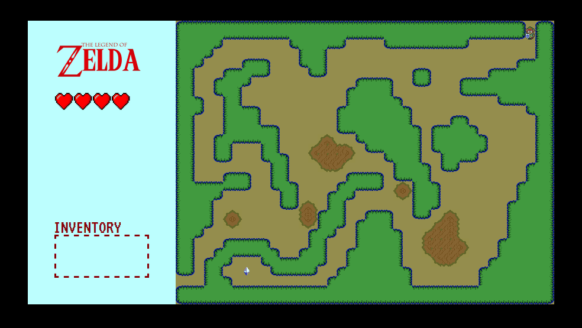

online here: www.garnes.one/zelda
 
 # Zelda : A &lt;Link&gt; to the Past



## Objectif

L'objectif de ce challenge est de générer un terrain, à partir
d'un sprite d'image.

## Sprite

Dans le projet, vous trouverez un **sprite** du terrain. Un sprite, c'est une
image qui en comportent plusieurs. C'est une technique que l'on a utilisé pour
développer les premiers jeux vidéos, pour économiser de la place. On utilise
aussi ce procédé en intégration, avec les [sprites CSS](https://developer.mozilla.org/fr/docs/Web/CSS/CSS_Images/Sprites_CSS).
Puisque nous devons développer en JS la map d'un jeu vidéo, l'occasion était
trop belle !

Pour afficher le même fichier image tout en affichant des images différentes,
la technique consiste à mettre cette image en `background-image` sur des éléments
de taille plus petite que l'image, et on décale l'image avec `background-poisition`.

Rassurez-vous, le code vous est fourni dans `css/tiles.css` ! Il fait appel au
fichier `images/sprite.png` qui contient toutes les tuiles graphiques que l'on
a besoin.

## Map

Vous trouverez aussi dans le projet un fichier `map.js`, comprenant un objet
`map` contenant un tableau de tuiles, ainsi que le type de terrain que représente
chaque caractères du tableau.

Cela correspond aux classes CSS qu'il va falloir appliquer à nos tuiles
(voir `css/tiles.css`). En plus d'ajouter une classe pour le type de terrain
de la tuile en cours, il va falloir ajouter une classe pour les tuiles alentours.

Par exemple, une tuile `'+'` est de type `bush`. Si elle est entouré par des
types `bush`, il va falloir lui donner les classes :
```html
<div class="tile bush top-bush right-bush bottom-bush left-bush"></div>
```

Pour une même tuile, mais avec du `'soil'` à droite :
```html
<div class="tile bush top-bush right-soil bottom-bush left-bush"></div>
```

## Instructions

### App.js

1. Dans `js/app.js`, on va créer un objet `app` responsable de l'ajout des objets dans le DOM.  
On va créer un conteneur `#map`.

2. L'élément `#map` doit aussi recevoir en `style` des dimensions, en fonction
de la longueur de l'objet `map` (de `js/map.js`). Chaque tuile est un carré 16 pixels.

3. Dans `#map`, on va venir ajouter en enfant toutes les tuiles `.tile`.

### Tile.js

1. Dans `js/tile.js`, on va créer un objet `tile` responsable de la création
des tuiles. On peut créer une méthode `create` chargé de créer une tuile.

2. Pour créer une tuile, il faut lui donner les bonnes classes, comme décrit
plus haut. Pour cela, on peut créer une méthode `getClassname`.

3. Pour venir positionner les tuiles, on utilise des `position: absolute`.
Il faut donc ajouter du style (`top` et `left`) pour venir placer la tuile
au bon endroit, avec une méthode `getStyle`.

4. Pour chaque tuile, on peut aussi utiliser une méthode `getType` qui sera
chargé de récupérer le type de tuile, en utilisant l'objet `map`.
